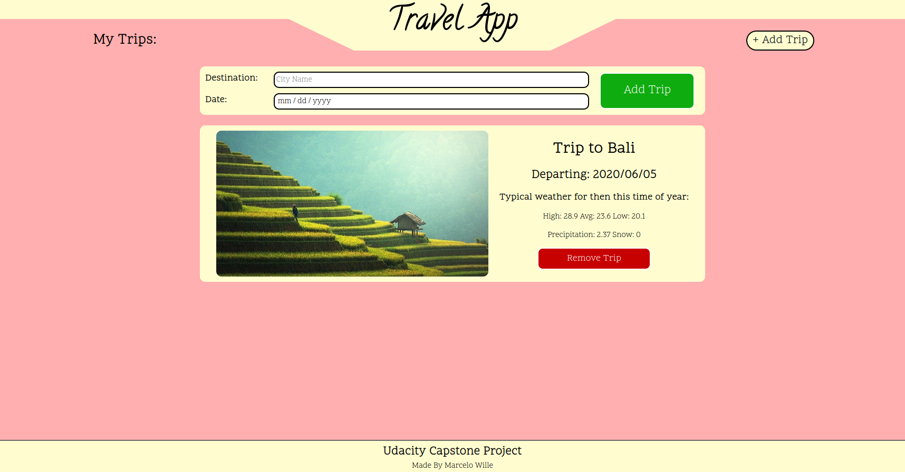

# Travel App

Creation of a web tool that allows users to enter
trips. The app then shows the user useful information
about the trip destination on that time of the year,
like usual weather conditions, using a series of APIs.

## Run

With node and npm installed:

`$ npm install`
`$ cnpm install node-sass@latest`
`$ npm run build-prod`
`$ npm start`

The web tool can be accessed at localhost:8081

## Test

`$ npm test`

The tests were made using the Jest framework, and
are located at `/src/tests`

### Acknowledgments

* Geoname API
* Weatherbit API
* Pixabay API

#### Udacity Front End Developer Capstone Project
